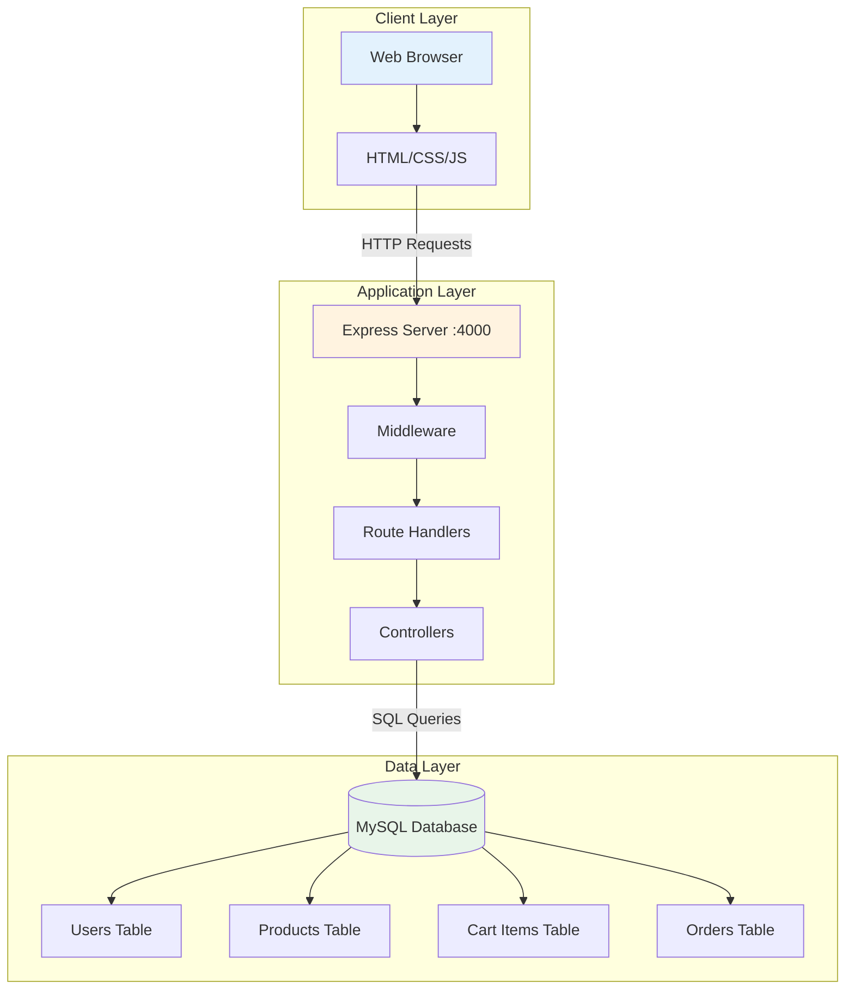
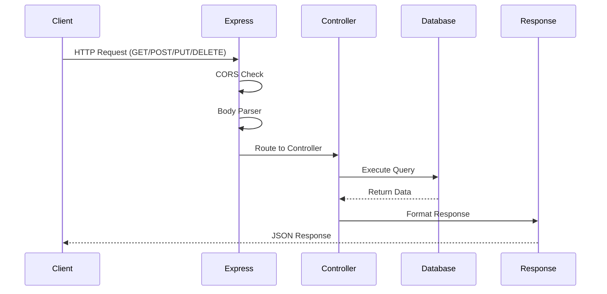
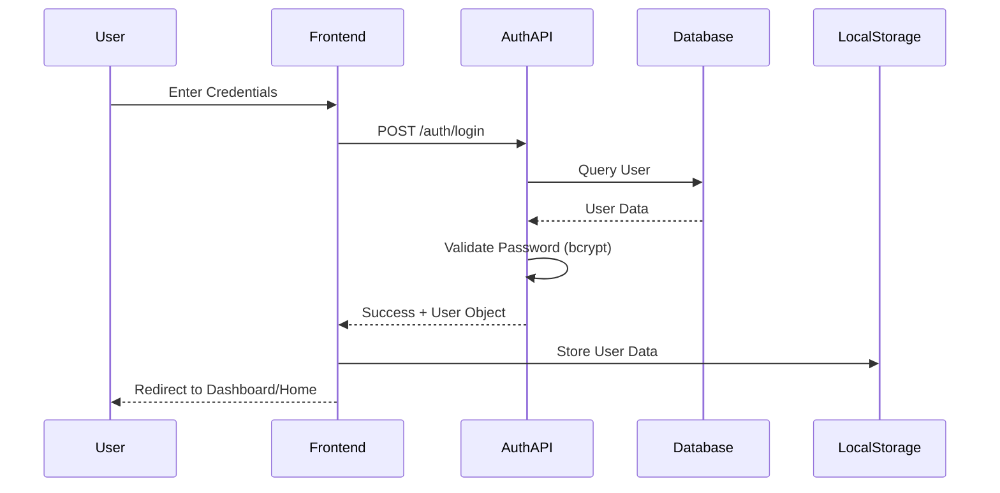
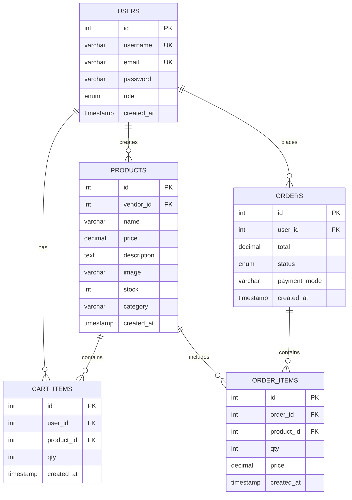
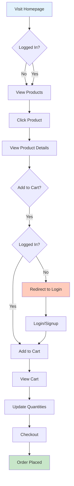
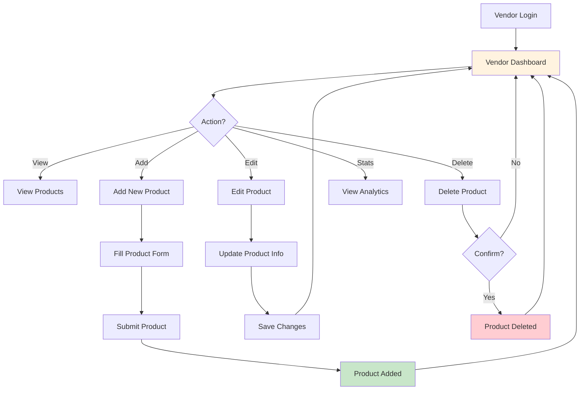
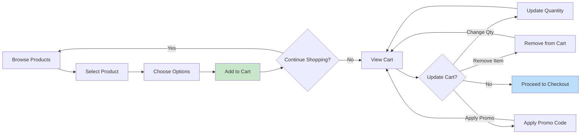

# TheTrend E-Commerce Platform


A full-stack e-commerce platform with vendor management, user authentication, shopping cart functionality, and product management. Built with Node.js, Express, and MySQL.

---

## 📑 Table of Contents

- [Features](#-features)
- [Tech Stack](#-tech-stack)
- [System Architecture](#-system-architecture)
- [Database Schema](#-database-schema)
- [Project Structure](#-project-structure)
- [Installation & Setup](#-installation--setup)
- [API Documentation](#-api-documentation)
- [User Flows](#-user-flows)
- [Configuration](#-configuration)
- [Usage Examples](#-usage-examples)
- [Contributing](#-contributing)
- [License](#-license)

---

## ✨ Features

### User Features
- 🔐 **User Authentication** - Secure signup/login with bcrypt password hashing
- 🛍️ **Product Browsing** - View all products with filtering and sorting
- 🛒 **Shopping Cart** - Add, update, and remove items from cart
- 💳 **Order Management** - Place orders and track order history
- 👤 **User Profiles** - Customer and vendor role-based access

### Vendor Features
- 📦 **Product Management** - CRUD operations for vendor products
- 📊 **Dashboard Analytics** - View sales statistics and product performance
- 📈 **Inventory Management** - Track stock levels and product availability
- 💰 **Revenue Tracking** - Monitor total revenue and orders

### Admin Features
- 🔧 **User Management** - Manage customer and vendor accounts
- 📋 **Order Overview** - View and manage all platform orders
- 🏪 **Platform Analytics** - Complete platform statistics

---

## 🛠️ Tech Stack

### Backend
- **Runtime**: Node.js (v18+)
- **Framework**: Express.js (v4.21.2)
- **Database**: MySQL (v8.0+)
- **Authentication**: bcrypt (v6.0.0), JWT-ready
- **ORM/Query Builder**: mysql2 (v3.15.3)

### Frontend
- **HTML5** - Semantic markup
- **CSS3** - Modern styling with Flexbox & Grid
- **JavaScript (ES6+)** - Vanilla JS with async/await
- **Icons**: Remix Icons (v4.7.0)
- **Fonts**: Google Fonts (Montserrat, Funnel Display)

### Development Tools
- **nodemon** (v3.0.1) - Auto-restart server
- **cors** (v2.8.5) - Cross-origin resource sharing
- **dotenv** (v16.6.1) - Environment variable management

---

## 🏗️ System Architecture

### Application Flow



### Request Flow



### User Authentication Flow



---

## 🗄️ Database Schema

### Entity Relationship Diagram



### Table Descriptions

#### **Users Table**
Stores user account information with role-based access control.

| Column | Type | Constraints | Description |
|--------|------|-------------|-------------|
| id | INT | PRIMARY KEY, AUTO_INCREMENT | Unique user identifier |
| username | VARCHAR(255) | NOT NULL, UNIQUE | User's display name |
| email | VARCHAR(255) | NOT NULL, UNIQUE | User's email address |
| password | VARCHAR(255) | NOT NULL | Bcrypt hashed password |
| role | ENUM | DEFAULT 'customer' | customer, vendor, or admin |
| created_at | TIMESTAMP | DEFAULT CURRENT_TIMESTAMP | Account creation date |

#### **Products Table**
Stores product information created by vendors.

| Column | Type | Constraints | Description |
|--------|------|-------------|-------------|
| id | INT | PRIMARY KEY, AUTO_INCREMENT | Unique product identifier |
| vendor_id | INT | NOT NULL, FOREIGN KEY | Reference to vendor user |
| name | VARCHAR(255) | NOT NULL | Product name |
| price | DECIMAL(10,2) | NOT NULL | Product price |
| description | TEXT | NULL | Product description |
| image | VARCHAR(255) | NULL | Product image URL |
| stock | INT | DEFAULT 0 | Available quantity |
| category | VARCHAR(100) | DEFAULT 'General' | Product category |
| created_at | TIMESTAMP | DEFAULT CURRENT_TIMESTAMP | Product creation date |

#### **Cart Items Table**
Stores items in user shopping carts.

| Column | Type | Constraints | Description |
|--------|------|-------------|-------------|
| id | INT | PRIMARY KEY, AUTO_INCREMENT | Unique cart item ID |
| user_id | INT | NOT NULL, FOREIGN KEY | Reference to user |
| product_id | INT | NOT NULL, FOREIGN KEY | Reference to product |
| qty | INT | NOT NULL, DEFAULT 1 | Quantity in cart |
| created_at | TIMESTAMP | DEFAULT CURRENT_TIMESTAMP | Added to cart date |

#### **Orders Table**
Stores customer orders.

| Column | Type | Constraints | Description |
|--------|------|-------------|-------------|
| id | INT | PRIMARY KEY, AUTO_INCREMENT | Unique order identifier |
| user_id | INT | NOT NULL, FOREIGN KEY | Reference to customer |
| total | DECIMAL(10,2) | NOT NULL | Order total amount |
| status | ENUM | DEFAULT 'pending' | Order status |
| payment_mode | VARCHAR(50) | NOT NULL | Payment method |
| created_at | TIMESTAMP | DEFAULT CURRENT_TIMESTAMP | Order placement date |

#### **Order Items Table**
Stores individual items within orders.

| Column | Type | Constraints | Description |
|--------|------|-------------|-------------|
| id | INT | PRIMARY KEY, AUTO_INCREMENT | Unique order item ID |
| order_id | INT | NOT NULL, FOREIGN KEY | Reference to order |
| product_id | INT | NOT NULL, FOREIGN KEY | Reference to product |
| qty | INT | NOT NULL | Quantity ordered |
| price | DECIMAL(10,2) | NOT NULL | Price at time of order |
| created_at | TIMESTAMP | DEFAULT CURRENT_TIMESTAMP | Item added date |

---

## 📁 Project Structure

```
ecommerce-platform/
├── public/                      # Static frontend assets
│   ├── css/                     # Stylesheets
│   │   ├── home.css            # Homepage styles
│   │   ├── login.css           # Authentication pages
│   │   ├── cart.css            # Shopping cart styles
│   │   ├── product.css         # Product detail page
│   │   ├── vendor.css          # Vendor dashboard
│   │   └── style.css           # Global styles
│   ├── js/                      # Client-side JavaScript
│   │   ├── auth.js             # Authentication helpers
│   │   ├── cart.js             # Cart functionality
│   │   ├── home.js             # Homepage logic
│   │   └── main.js             # Global scripts
│   └── images/                  # Image assets
│       ├── products/           # Product images
│       └── models/             # Model images
├── views/                       # HTML pages
│   ├── home.html               # Landing page
│   ├── login.html              # Login page
│   ├── signup.html             # Registration page
│   ├── cart.html               # Shopping cart
│   ├── order-page.html         # Product details
│   ├── product-list.html       # All products
│   └── vendor-dashboard.html   # Vendor management
├── src/                         # Backend source code
│   ├── config/                 # Configuration files
│   │   ├── db.js              # Database connection
│   │   ├── jwt.js             # JWT config
│   │   └── constants.js       # App constants
│   ├── controllers/            # Business logic
│   │   ├── authController.js  # Authentication logic
│   │   ├── productController.js # Product CRUD
│   │   ├── cartController.js  # Cart operations
│   │   └── orderController.js # Order processing
│   ├── models/                 # Data models (placeholder)
│   │   ├── userModel.js
│   │   ├── productModel.js
│   │   ├── cartModel.js
│   │   └── orderModel.js
│   ├── routes/                 # API route definitions
│   │   ├── authRoutes.js      # /auth endpoints
│   │   ├── productRoutes.js   # /products endpoints
│   │   ├── cartRoutes.js      # /cart endpoints
│   │   └── orderRoutes.js     # /orders endpoints
│   └── server.js              # Express app entry point
├── .gitignore                  # Git ignore rules
├── package.json                # Dependencies & scripts
├── package-lock.json           # Locked dependencies
└── README.md                   # This file
```

---

## 🚀 Installation & Setup

### Prerequisites

- **Node.js** (v18.0.0 or higher)
- **MySQL** (v8.0 or higher)
- **npm** (v6.0.0 or higher)
- **Git**

### Step 1: Clone Repository

```bash
git clone <repository-url>
cd ecommerce-platform
```

### Step 2: Install Dependencies

```bash
npm install
```

### Step 3: Database Setup

1. **Start MySQL Server** (default port 3307)

2. **Create Database**:
```sql
CREATE DATABASE dummyDB;
```

3. **Update Database Configuration** in `src/config/db.js`:
```javascript
const db = mysql.createConnection({
  host: 'localhost',
  user: 'root',
  port: 3307,
  password: '',  // Add your MySQL password
  database: 'dummyDB'
});
```

4. **Tables are auto-created** on first server start

### Step 4: Environment Variables (Optional)

Create a `.env` file in the root directory:

```env
PORT=4000
DB_HOST=localhost
DB_PORT=3307
DB_USER=root
DB_PASSWORD=
DB_NAME=dummyDB
JWT_SECRET=your_jwt_secret_key_here
NODE_ENV=development
```

### Step 5: Start Server

**Development Mode** (with auto-restart):
```bash
npm run dev
```

**Production Mode**:
```bash
npm start
```

Server will start on: `http://localhost:4000`

### Step 6: Access Application

- **Home Page**: http://localhost:4000/views/home.html
- **Login**: http://localhost:4000/views/login.html
- **Signup**: http://localhost:4000/views/signup.html

---

## 📚 API Documentation

### Base URL
```
http://localhost:4000
```

### Authentication Endpoints

#### **POST** `/auth/signup`
Register a new user account.

**Request Body:**
```json
{
  "username": "john_doe",
  "email": "john@example.com",
  "password": "password123",
  "role": "customer"
}
```

**Response (201 Created):**
```json
{
  "success": true,
  "message": "User registered successfully",
  "user": {
    "id": 1,
    "username": "john_doe",
    "email": "john@example.com",
    "role": "customer"
  }
}
```

#### **POST** `/auth/login`
Authenticate user and receive user data.

**Request Body:**
```json
{
  "email": "john@example.com",
  "password": "password123"
}
```

**Response (200 OK):**
```json
{
  "success": true,
  "message": "Login successful",
  "user": {
    "id": 1,
    "username": "john_doe",
    "email": "john@example.com",
    "role": "customer"
  }
}
```

### Product Endpoints

#### **GET** `/products`
Retrieve all products.

**Response (200 OK):**
```json
[
  {
    "id": 1,
    "vendor_id": 2,
    "name": "Classic Jacket",
    "price": "89.99",
    "description": "A stylish classic jacket",
    "image": "/public/images/products/jacket.png",
    "stock": 25,
    "category": "Outerwear",
    "created_at": "2024-01-15T10:30:00.000Z"
  }
]
```

#### **GET** `/products/:id`
Get single product by ID.

**Response (200 OK):**
```json
{
  "id": 1,
  "vendor_id": 2,
  "name": "Classic Jacket",
  "price": "89.99",
  "description": "A stylish classic jacket",
  "image": "/public/images/products/jacket.png",
  "stock": 25,
  "category": "Outerwear",
  "created_at": "2024-01-15T10:30:00.000Z"
}
```

#### **GET** `/products/vendor/:vendorId`
Get all products by specific vendor.

#### **POST** `/products/add`
Add a new product (vendors only).

**Request Body:**
```json
{
  "vendor_id": 2,
  "name": "New Product",
  "price": 49.99,
  "stock": 100,
  "description": "Product description",
  "image": "/public/images/products/product.png",
  "category": "Fashion"
}
```

**Response (201 Created):**
```json
{
  "message": "Product added successfully",
  "productId": 5
}
```

#### **PUT** `/products/update/:id`
Update existing product.

#### **DELETE** `/products/delete/:id`
Delete a product.

### Cart Endpoints

#### **POST** `/cart/add`
Add item to cart.

**Request Body:**
```json
{
  "user_id": 1,
  "product_id": 5,
  "qty": 2
}
```

**Response (201 Created):**
```json
{
  "message": "Product added to cart",
  "cart_item_id": 3
}
```

#### **GET** `/cart/:user_id`
Get user's cart items with product details.

**Response (200 OK):**
```json
[
  {
    "id": 3,
    "name": "Classic Jacket",
    "price": "89.99",
    "qty": 2,
    "product_id": 5,
    "image": "/public/images/products/jacket.png"
  }
]
```

#### **PUT** `/cart/update/:id`
Update cart item quantity.

**Request Body:**
```json
{
  "qty": 3
}
```

#### **DELETE** `/cart/delete/:id`
Remove item from cart.

---

## 🔄 User Flows

### Customer Journey



### Vendor Journey



### Shopping Cart Flow



---

## ⚙️ Configuration

### Database Configuration

Located in `src/config/db.js`:

```javascript
const db = mysql.createConnection({
  host: 'localhost',      // Database host
  user: 'root',           // MySQL username
  port: 3307,            // MySQL port
  password: '',          // MySQL password
  database: 'dummyDB'    // Database name
});
```

### Server Configuration

Located in `src/server.js`:

```javascript
const PORT = process.env.PORT || 4000;
```

### CORS Configuration

```javascript
app.use(cors({
  origin: '*',
  methods: ['GET', 'POST', 'PUT', 'DELETE', 'OPTIONS'],
  allowedHeaders: ['Content-Type', 'Authorization']
}));
```

---

## 💡 Usage Examples

### Example 1: Customer Registration and Login

```javascript
// Register new customer
const signupResponse = await fetch('http://localhost:4000/auth/signup', {
  method: 'POST',
  headers: { 'Content-Type': 'application/json' },
  body: JSON.stringify({
    username: 'jane_smith',
    email: 'jane@example.com',
    password: 'securepass123',
    role: 'customer'
  })
});

// Login
const loginResponse = await fetch('http://localhost:4000/auth/login', {
  method: 'POST',
  headers: { 'Content-Type': 'application/json' },
  body: JSON.stringify({
    email: 'jane@example.com',
    password: 'securepass123'
  })
});

const userData = await loginResponse.json();
localStorage.setItem('user', JSON.stringify(userData.user));
```

### Example 2: Adding Product to Cart

```javascript
const user = JSON.parse(localStorage.getItem('user'));

const addToCartResponse = await fetch('http://localhost:4000/cart/add', {
  method: 'POST',
  headers: { 'Content-Type': 'application/json' },
  body: JSON.stringify({
    user_id: user.id,
    product_id: 5,
    qty: 2
  })
});

const result = await addToCartResponse.json();
console.log(result.message); // "Product added to cart"
```

### Example 3: Vendor Adding Product

```javascript
const vendor = JSON.parse(localStorage.getItem('user'));

const addProductResponse = await fetch('http://localhost:4000/products/add', {
  method: 'POST',
  headers: { 'Content-Type': 'application/json' },
  body: JSON.stringify({
    vendor_id: vendor.id,
    name: 'Premium Hoodie',
    price: 79.99,
    stock: 50,
    description: 'Comfortable premium quality hoodie',
    image: '/public/images/products/hoodie.png',
    category: 'Apparel'
  })
});
```

---

## 🤝 Contributing

Contributions are welcome! Please follow these steps:

1. **Fork the repository**
2. **Create a feature branch**: `git checkout -b feature/amazing-feature`
3. **Commit changes**: `git commit -m 'Add amazing feature'`
4. **Push to branch**: `git push origin feature/amazing-feature`
5. **Open a Pull Request**

### Code Style Guidelines

- Use **camelCase** for JavaScript variables and functions
- Use **PascalCase** for component/class names
- Follow **RESTful** API design principles
- Write **clear comments** for complex logic
- Use **async/await** for asynchronous operations

---

## 📄 License

This project is licensed under the **MIT License**.

```
MIT License

Copyright (c) 2024 TheTrend E-Commerce

Permission is hereby granted, free of charge, to any person obtaining a copy
of this software and associated documentation files (the "Software"), to deal
in the Software without restriction, including without limitation the rights
to use, copy, modify, merge, publish, distribute, sublicense, and/or sell
copies of the Software, and to permit persons to whom the Software is
furnished to do so, subject to the following conditions:

The above copyright notice and this permission notice shall be included in all
copies or substantial portions of the Software.

THE SOFTWARE IS PROVIDED "AS IS", WITHOUT WARRANTY OF ANY KIND, EXPRESS OR
IMPLIED, INCLUDING BUT NOT LIMITED TO THE WARRANTIES OF MERCHANTABILITY,
FITNESS FOR A PARTICULAR PURPOSE AND NONINFRINGEMENT. IN NO EVENT SHALL THE
AUTHORS OR COPYRIGHT HOLDERS BE LIABLE FOR ANY CLAIM, DAMAGES OR OTHER
LIABILITY, WHETHER IN AN ACTION OF CONTRACT, TORT OR OTHERWISE, ARISING FROM,
OUT OF OR IN CONNECTION WITH THE SOFTWARE OR THE USE OR OTHER DEALINGS IN THE
SOFTWARE.
```

---

## 📞 Support & Contact

For issues, questions, or suggestions:

- **GitHub Issues**: Open an issue in the repository
- **Email**: support@thetrend.com
- **Documentation**: Check this README for detailed information

---

## 🎯 Future Enhancements

- [ ] Payment gateway integration (Stripe/PayPal)
- [ ] Email notifications for orders
- [ ] Product reviews and ratings
- [ ] Wishlist functionality
- [ ] Advanced search and filters
- [ ] Order tracking system
- [ ] Admin panel for platform management
- [ ] Image upload for products
- [ ] Multi-language support
- [ ] Mobile app development

---

**Built with ❤️ by The Development Team**

*Last Updated: November 2024*
