# 🛒 E-Commerce Platform

<div align="center">


**A full-stack e-commerce platform with vendor management, shopping cart, and order processing capabilities.**

[Live Demo](#) • [Documentation](#) • [Report Bug](https://github.com/yourusername/ecommerce-app/issues) • [Request Feature](https://github.com/yourusername/ecommerce-app/issues)

</div>

---

## 📑 Table of Contents

- [✨ Features](#-features)
- [🏗️ Architecture](#️-architecture)
  - [System Architecture](#system-architecture)
  - [Database Schema](#database-schema)
  - [Request Flow](#request-flow)
- [📁 Project Structure](#-project-structure)
- [🔧 Component Breakdown](#-component-breakdown)
  - [Models](#-models)
  - [Controllers](#-controllers)
  - [Routes](#-routes)
  - [Views](#-views)
- [💻 API Documentation](#-api-documentation)
  - [Authentication Endpoints](#authentication-endpoints)
  - [Product Endpoints](#product-endpoints)
  - [Cart Endpoints](#cart-endpoints)
  - [Order Endpoints](#order-endpoints)
  - [Vendor Endpoints](#vendor-endpoints)
- [🎨 Frontend Pages](#-frontend-pages)
- [🚀 Getting Started](#-getting-started)
- [🤝 Contributing](#-contributing)
- [📄 License](#-license)
- [👥 Authors](#-authors)
- [🙏 Acknowledgments](#-acknowledgments)

---

## ✨ Features

### 👤 User Management
- ✅ User registration with email verification
- ✅ Secure login/logout with JWT authentication
- ✅ Role-based access control (Customer/Vendor)
- ✅ Profile management and settings

### 🏪 Vendor Features
- ✅ Vendor dashboard for product management
- ✅ Add, edit, and delete products
- ✅ Inventory tracking and management
- ✅ Order fulfillment interface
- ✅ Sales analytics and reporting

### 🛍️ Shopping Experience
- ✅ Browse product catalog with filtering
- ✅ Product search and categorization
- ✅ Detailed product pages
- ✅ Add to cart functionality
- ✅ Real-time cart updates
- ✅ Persistent cart across sessions

### 💳 Order Processing
- ✅ Secure checkout process
- ✅ Order confirmation and tracking
- ✅ Order history for customers
- ✅ Multiple payment options support
- ✅ Order status updates

### 🎯 Additional Features
- ✅ Responsive design for all devices
- ✅ RESTful API architecture
- ✅ Error handling and validation
- ✅ Session management
- ✅ Database indexing for performance

---

## 🏗️ Architecture

### System Architecture

```mermaid
graph TB
  subgraph Client["🌐 Client Layer"]
    Browser[Web Browser]
    ClientJS[Client-Side JavaScript<br/>auth.js, cart.js, product.js]
  end

  subgraph Presentation["🎨 Presentation Layer"]
    Views[HTML Views<br/>signup, login, home, etc.]
    Static[Static Assets<br/>CSS, Images, JS]
  end

  subgraph Application["⚙️ Application Layer"]
    Server[Express Server<br/>server.js]
    Routes[API Routes<br/>auth, vendor, product, cart, order]
    Controllers[Controllers<br/>Business Logic]
    Models[Models<br/>Data Access Layer]
    Config[Configuration<br/>db.js, jwt.js]
  end

  subgraph Data["💾 Data Layer"]
    MySQL[(MySQL Database<br/>ecommerce_db)]
    XAMPP[XAMPP<br/>Local Server]
  end

  Browser --> ClientJS
  ClientJS --> Views
  ClientJS --> Static
  Views --> Server
  Static --> Server
  
  Server --> Routes
  Routes --> Controllers
  Controllers --> Models
  Models --> Config
  Config --> MySQL
  
  XAMPP -.manages.-> MySQL

  style MySQL fill:#e1ffe1,stroke:#2d7a2d,stroke-width:3px
  style Server fill:#fff4e1,stroke:#d4a017,stroke-width:3px
  style Views fill:#f5f5ff,stroke:#6b5b95,stroke-width:3px
  style Browser fill:#e1f5ff,stroke:#4a90e2,stroke-width:3px
```




### Database Schema


Notes:
- Field names use snake_case and follow SQL conventions (e.g., `created_at`).
- Primary keys are `INT AUTO_INCREMENT` and foreign keys reference the related table `id` columns.
- Use InnoDB engine for transaction support and proper foreign key enforcement.
- Keep `utf8mb4` charset for full Unicode support.

### Request Flow


---

## 📁 Project Structure

```
ecommerce-app/
│
├── 📁 public/                    # Static assets
│   ├── 📁 css/                   # Stylesheets
│   │   ├── style.css
│   │   ├── components.css
│   │   └── responsive.css
│   │
│   ├── 📁 js/                    # Client-side JavaScript
│   │   ├── main.js
│   │   ├── cart.js
│   │   ├── product.js
│   │   └── auth.js
│   │
│   └── 📁 images/                # Image assets
│       ├── logo.png
│       ├── products/
│       └── icons/
│
├── 📁 views/                     # HTML templates
│   ├── signup.html               # User registration page
│   ├── login.html                # User login page
│   ├── home.html                 # Landing page
│   ├── product-list.html         # Product catalog
│   ├── cart.html                 # Shopping cart
│   ├── vendor-dashboard.html     # Vendor management
│   └── order-page.html           # Order details & history
│
├── 📁 src/                       # Source code
│   │
│   ├── 📁 routes/                # API route definitions
│   │   ├── authRoutes.js         # Authentication routes
│   │   ├── vendorRoutes.js       # Vendor management routes
│   │   ├── productRoutes.js      # Product CRUD routes
│   │   ├── cartRoutes.js         # Cart operations routes
│   │   └── orderRoutes.js        # Order processing routes
│   │
│   ├── 📁 controllers/           # Business logic layer
│   │   ├── authController.js     # Auth logic
│   │   ├── vendorController.js   # Vendor logic
│   │   ├── productController.js  # Product logic
│   │   ├── cartController.js     # Cart logic
│   │   └── orderController.js    # Order logic
│   │
│   ├── 📁 models/                # Database schemas
│   │   ├── userModel.js          # User schema
│   │   ├── productModel.js       # Product schema
│   │   ├── cartModel.js          # Cart schema
│   │   └── orderModel.js         # Order schema
│   │
│   ├── 📁 config/                # Configuration files
│   │   ├── db.js                 # Database connection
│   │   ├── jwt.js                # JWT configuration
│   │   └── constants.js          # App constants
│   │
│   └── server.js                 # Application entry point
│
├── 📄 package.json               # Dependencies & scripts
├── 📄 .env                       # Environment variables
├── 📄 .gitignore                # Git ignore rules
└── 📄 README.md                 # Project documentation
```

---

## 🔧 Component Breakdown

### 🗄️ Models

<details>
<summary><b>👤 User Model (userModel.js)</b></summary>

### Schema Structure
```javascript
{
  name: String (required),
  email: String (required, unique),
  password: String (required, hashed),
  role: String (enum: ['customer', 'vendor', 'admin']),
  phone: String,
  address: Object {
    street: String,
    city: String,
    state: String,
    zipCode: String,
    country: String
  },
  createdAt: Date,
  updatedAt: Date
}
```

### Methods
- `hashPassword()` - Bcrypt password hashing
- `comparePassword()` - Password verification
- `generateAuthToken()` - JWT token generation
- `toJSON()` - Remove sensitive data from response

### Validations
- Email format validation
- Password strength requirements (min 8 chars)
- Unique email constraint
- Required field validations

</details>

<details>
<summary><b>🛍️ Product Model (productModel.js)</b></summary>

### Schema Structure
```javascript
{
  name: String (required),
  description: String (required),
  price: Number (required, min: 0),
  stock: Number (required, min: 0),
  category: String (required),
  images: [String],
  vendorId: ObjectId (ref: 'User'),
  ratings: {
    average: Number,
    count: Number
  },
  specifications: Object,
  isActive: Boolean,
  createdAt: Date,
  updatedAt: Date
}
```

### Methods
- `updateStock()` - Inventory management
- `addRating()` - Update product ratings
- `isAvailable()` - Check stock availability
- `applyDiscount()` - Price calculation

### Indexes
- `vendorId` - For vendor product queries
- `category` - For category filtering
- `name` (text) - For search functionality

</details>

<details>
<summary><b>🛒 Cart Model (cartModel.js)</b></summary>

### Schema Structure
```javascript
{
  userId: ObjectId (ref: 'User', required),
  items: [{
    productId: ObjectId (ref: 'Product'),
    quantity: Number (min: 1),
    price: Number,
    addedAt: Date
  }],
  totalPrice: Number,
  totalItems: Number,
  updatedAt: Date
}
```

### Methods
- `addItem()` - Add product to cart
- `removeItem()` - Remove product from cart
- `updateQuantity()` - Modify item quantity
- `clearCart()` - Empty cart
- `calculateTotal()` - Recalculate cart total

### Virtuals
- `itemCount` - Total number of items
- `isEmpty` - Check if cart is empty

</details>

<details>
<summary><b>📦 Order Model (orderModel.js)</b></summary>

### Schema Structure
```javascript
{
  orderId: String (unique, auto-generated),
  userId: ObjectId (ref: 'User', required),
  items: [{
    productId: ObjectId (ref: 'Product'),
    vendorId: ObjectId (ref: 'User'),
    quantity: Number,
    price: Number,
    status: String
  }],
  totalAmount: Number (required),
  status: String (enum: ['pending', 'confirmed', 'processing', 'shipped', 'delivered', 'cancelled']),
  shippingAddress: Object,
  paymentMethod: String,
  paymentStatus: String,
  trackingNumber: String,
  createdAt: Date,
  updatedAt: Date
}
```

### Methods
- `updateStatus()` - Change order status
- `cancelOrder()` - Cancel order
- `addTracking()` - Add tracking information
- `calculateTotal()` - Calculate order total

### Middleware
- Pre-save: Generate unique orderId
- Post-save: Update product stock
- Pre-update: Log status changes

</details>

---

### 🎮 Controllers

<details>
<summary><b>🔐 Auth Controller (authController.js)</b></summary>

### Responsibilities
- User registration and authentication
- JWT token management
- Password reset functionality
- Session management

### Key Functions

#### `signup(req, res)`
```javascript
// Register new user
- Validate input data
- Check if user exists
- Hash password
- Create user record
- Generate JWT token
- Return user & token
```

#### `login(req, res)`
```javascript
// User login
- Validate credentials
- Verify password
- Generate JWT token
- Create session
- Return user & token
```

#### `logout(req, res)`
```javascript
// User logout
- Invalidate token
- Clear session
- Return success message
```

#### `resetPassword(req, res)`
```javascript
// Password reset
- Verify reset token
- Validate new password
- Update password
- Send confirmation email
```

### Error Handling
- Invalid credentials (401)
- User already exists (409)
- Validation errors (400)
- Server errors (500)

</details>

<details>
<summary><b>🏪 Vendor Controller (vendorController.js)</b></summary>

### Responsibilities
- Vendor dashboard data
- Product management for vendors
- Order management
- Sales analytics

### Key Functions

#### `getDashboard(req, res)`
```javascript
// Get vendor dashboard data
- Fetch vendor products
- Get pending orders
- Calculate sales statistics
- Return dashboard data
```

#### `manageProducts(req, res)`
```javascript
// CRUD operations for vendor products
- List vendor products
- Add new product
- Update product
- Delete product
```

#### `getOrders(req, res)`
```javascript
// Get vendor orders
- Fetch orders containing vendor products
- Filter by status
- Sort by date
- Return orders
```

#### `updateOrderStatus(req, res)`
```javascript
// Update order item status
- Verify vendor ownership
- Update status
- Notify customer
- Return updated order
```

### Access Control
- Verify vendor role
- Check product ownership
- Validate permissions

</details>

<details>
<summary><b>📦 Product Controller (productController.js)</b></summary>

### Responsibilities
- Product catalog management
- Search and filtering
- Product details retrieval
- Inventory updates

### Key Functions

#### `getAllProducts(req, res)`
```javascript
// Get product list with filters
- Apply filters (category, price, rating)
- Implement pagination
- Sort results
- Return products
```

#### `getProductById(req, res)`
```javascript
// Get single product details
- Fetch product by ID
- Populate vendor info
- Include reviews
- Return product
```

#### `createProduct(req, res)`
```javascript
// Add new product (vendor only)
- Validate product data
- Upload images
- Create product record
- Return created product
```

#### `updateProduct(req, res)`
```javascript
// Update product (vendor only)
- Verify ownership
- Validate updates
- Update product
- Return updated product
```

#### `deleteProduct(req, res)`
```javascript
// Delete product (vendor only)
- Verify ownership
- Check active orders
- Soft delete product
- Return success
```

#### `searchProducts(req, res)`
```javascript
// Search products
- Parse search query
- Apply text search
- Filter results
- Return matches
```

### Features
- Pagination support
- Advanced filtering
- Image upload handling
- Stock validation

</details>

<details>
<summary><b>🛒 Cart Controller (cartController.js)</b></summary>

### Responsibilities
- Shopping cart operations
- Cart persistence
- Price calculations
- Cart validation

### Key Functions

#### `getCart(req, res)`
```javascript
// Get user cart
- Fetch cart by userId
- Populate product details
- Calculate totals
- Return cart
```

#### `addToCart(req, res)`
```javascript
// Add item to cart
- Validate product & stock
- Check if item exists
- Update quantity or add new
- Recalculate total
- Return updated cart
```

#### `updateCartItem(req, res)`
```javascript
// Update item quantity
- Validate quantity
- Check stock availability
- Update cart item
- Recalculate total
- Return updated cart
```

#### `removeFromCart(req, res)`
```javascript
// Remove item from cart
- Find cart item
- Remove item
- Recalculate total
- Return updated cart
```

#### `clearCart(req, res)`
```javascript
// Empty cart
- Remove all items
- Reset totals
- Return empty cart
```

### Validations
- Stock availability checks
- Price verification
- Quantity limits
- Product existence

</details>

<details>
<summary><b>📋 Order Controller (orderController.js)</b></summary>

### Responsibilities
- Order creation and processing
- Order tracking
- Payment integration
- Order history

### Key Functions

#### `createOrder(req, res)`
```javascript
// Create new order
- Validate cart items
- Check stock availability
- Calculate order total
- Process payment
- Create order record
- Clear cart
- Send confirmation
- Return order
```

#### `getOrders(req, res)`
```javascript
// Get user order history
- Fetch user orders
- Sort by date
- Populate product details
- Return orders
```

#### `getOrderById(req, res)`
```javascript
// Get order details
- Fetch order by ID
- Verify ownership
- Populate details
- Return order
```

#### `updateOrderStatus(req, res)`
```javascript
// Update order status (admin/vendor)
- Verify permissions
- Update status
- Send notifications
- Log status change
- Return updated order
```

#### `cancelOrder(req, res)`
```javascript
// Cancel order
- Check order status
- Verify cancellation eligibility
- Process refund
- Update stock
- Return confirmation
```

### Payment Processing
- Payment validation
- Transaction recording
- Refund handling
- Payment status tracking

### Notifications
- Order confirmation emails
- Status update notifications
- Shipping notifications
- Delivery confirmations

</details>

---

### 🛤️ Routes

<details>
<summary><b>🔐 Authentication Routes (authRoutes.js)</b></summary>

### Endpoints

| Method | Endpoint | Description | Auth Required |
|--------|----------|-------------|---------------|
| POST | `/api/auth/signup` | Register new user | ❌ |
| POST | `/api/auth/login` | User login | ❌ |
| POST | `/api/auth/logout` | User logout | ✅ |
| POST | `/api/auth/refresh` | Refresh JWT token | ✅ |
| POST | `/api/auth/forgot-password` | Request password reset | ❌ |
| POST | `/api/auth/reset-password` | Reset password | ❌ |
| GET | `/api/auth/profile` | Get user profile | ✅ |
| PUT | `/api/auth/profile` | Update profile | ✅ |

### Middleware
- Input validation
- Rate limiting
- JWT verification

</details>

<details>
<summary><b>🏪 Vendor Routes (vendorRoutes.js)</b></summary>

### Endpoints

| Method | Endpoint | Description | Role Required |
|--------|----------|-------------|---------------|
| GET | `/api/vendor/dashboard` | Get dashboard data | Vendor |
| GET | `/api/vendor/products` | List vendor products | Vendor |
| POST | `/api/vendor/products` | Add new product | Vendor |
| PUT | `/api/vendor/products/:id` | Update product | Vendor |
| DELETE | `/api/vendor/products/:id` | Delete product | Vendor |
| GET | `/api/vendor/orders` | Get vendor orders | Vendor |
| PUT | `/api/vendor/orders/:id` | Update order status | Vendor |
| GET | `/api/vendor/analytics` | Get sales analytics | Vendor |

### Middleware
- Vendor role verification
- Product ownership validation
- File upload handling

</details>

<details>
<summary><b>📦 Product Routes (productRoutes.js)</b></summary>

### Endpoints

| Method | Endpoint | Description | Auth Required |
|--------|----------|-------------|---------------|
| GET | `/api/products` | Get all products | ❌ |
| GET | `/api/products/:id` | Get product details | ❌ |
| GET | `/api/products/search` | Search products | ❌ |
| GET | `/api/products/category/:category` | Filter by category | ❌ |
| POST | `/api/products` | Create product | ✅ (Vendor) |
| PUT | `/api/products/:id` | Update product | ✅ (Vendor) |
| DELETE | `/api/products/:id` | Delete product | ✅ (Vendor) |
| POST | `/api/products/:id/review` | Add review | ✅ |

### Query Parameters
- `page` - Pagination
- `limit` - Items per page
- `sort` - Sort field
- `order` - Sort order (asc/desc)
- `minPrice` - Minimum price
- `maxPrice` - Maximum price
- `category` - Product category
- `search` - Search query

</details>

<details>
<summary><b>🛒 Cart Routes (cartRoutes.js)</b></summary>

### Endpoints

| Method | Endpoint | Description | Auth Required |
|--------|----------|-------------|---------------|
| GET | `/api/cart` | Get user cart | ✅ |
| POST | `/api/cart` | Add item to cart | ✅ |
| PUT | `/api/cart/:itemId` | Update cart item | ✅ |
| DELETE | `/api/cart/:itemId` | Remove cart item | ✅ |
| DELETE | `/api/cart` | Clear cart | ✅ |
| GET | `/api/cart/count` | Get cart item count | ✅ |

### Request Body Examples

**Add to Cart:**
```json
{
  "productId": "60d5ec49f1b2c72b8c8e4a1b",
  "quantity": 2
}
```

**Update Quantity:**
```json
{
  "quantity": 5
}
```

</details>

<details>
<summary><b>📋 Order Routes (orderRoutes.js)</b></summary>

### Endpoints

| Method | Endpoint | Description | Auth Required |
|--------|----------|-------------|---------------|
| POST | `/api/orders` | Create order | ✅ |
| GET | `/api/orders` | Get user orders | ✅ |
| GET | `/api/orders/:id` | Get order details | ✅ |
| PUT | `/api/orders/:id/cancel` | Cancel order | ✅ |
| GET | `/api/orders/:id/track` | Track order | ✅ |
| POST | `/api/orders/:id/payment` | Process payment | ✅ |

### Request Body Examples

**Create Order:**
```json
{
  "shippingAddress": {
    "street": "123 Main St",
    "city": "New York",
    "state": "NY",
    "zipCode": "10001",
    "country": "USA"
  },
  "paymentMethod": "credit_card"
}
```

</details>

---

### 🎨 Views

<details>
<summary><b>🔐 signup.html - User Registration</b></summary>

### Features
- Registration form with validation
- Email verification
- Password strength indicator
- Terms and conditions
- Social login options

### Form Fields
- Full Name (required)
- Email (required, validated)
- Password (required, min 8 chars)
- Confirm Password (required)
- User Type (Customer/Vendor)
- Accept Terms (checkbox)

### Client-Side Validation
- Real-time email format checking
- Password strength meter
- Password match validation
- Terms acceptance requirement

### API Integration
```javascript
POST /api/auth/signup
Body: { name, email, password, role }
```

</details>

<details>
<summary><b>🔑 login.html - User Authentication</b></summary>

### Features
- Login form
- Remember me option
- Forgot password link
- Social login integration
- Error messaging

### Form Fields
- Email (required)
- Password (required)
- Remember Me (checkbox)

### API Integration
```javascript
POST /api/auth/login
Body: { email, password }
Response: { token, user }
```

### Session Management
- JWT token storage
- Auto-redirect on success
- Session persistence

</details>

<details>
<summary><b>🏠 home.html - Landing Page</b></summary>

### Sections
1. **Hero Section**
   - Featured products
   - Call-to-action buttons
   - Promotional banners

2. **Categories**
   - Product category grid
   - Quick navigation
   - Category images

3. **Featured Products**
   - Best sellers
   - New arrivals
   - Special offers

4. **Testimonials**
   - Customer reviews
   - Rating displays

5. **Newsletter Signup**
   - Email subscription form
   - Promotional offers

### Dynamic Content
- Real-time product data
- Personalized recommendations
- Location-based offers

</details>

<details>
<summary><b>📦 product-list.html - Product Catalog</b></summary>

### Features
- Product grid/list view toggle
- Advanced filtering sidebar
- Sort options
- Pagination
- Quick view modal
- Add to cart button

### Filters
- Price range slider
- Category checkboxes
- Rating filter
- Availability filter
- Brand filter

### Sort Options
- Price: Low to High
- Price: High to Low
- Newest First
- Best Selling
- Top Rated

### Product Card
- Product image
- Product name
- Price
- Rating
- Quick add to cart
- View details button

</details>

<details>
<summary><b>🛒 cart.html - Shopping Cart</b></summary>

### Components
1. **Cart Items List**
   - Product details
   - Quantity selector
   - Remove button
   - Subtotal per item

2. **Cart Summary**
   - Subtotal
   - Tax calculation
   - Shipping estimate
   - Total amount
   - Promo code input

3. **Actions**
   - Continue shopping link
   - Clear cart button
   - Checkout button

### Features
- Real-time price updates
- Stock validation
- Quantity limits
- Empty cart state
- Save for later option

### API Integration
```javascript
GET /api/cart
POST /api/cart (add item)
PUT /api/cart/:itemId (update)
DELETE /api/cart/:itemId (remove)
```

</details>

<details>
<summary><b>🏪 vendor-dashboard.html - Vendor Panel</b></summary>

### Dashboard Sections

1. **Overview Cards**
   - Total Products
   - Total Orders
   - Revenue
   - Pending Orders

2. **Product Management**
   - Product list table
   - Add product button
   - Edit/Delete actions
   - Stock status

3. **Order Management**
   - Order list
   - Status filters
   - Order details modal
   - Update status

4. **Analytics**
   - Sales chart
   - Top products
   - Revenue trends

### Product Form
- Product name
- Description
- Price
- Stock quantity
- Category
- Image upload
- Specifications

### Features
- Real-time updates
- Search and filter
- Bulk actions
- Export data
- Notifications

</details>

<details>
<summary><b>📋 order-page.html - Order Management</b></summary>

### Components

1. **Order List** (for customers)
   - Order cards
   - Order status badges
   - Order date
   - Total amount
   - View details button

2. **Order Details**
   - Order number
   - Order date
   - Status timeline
   - Shipping address
   - Payment method
   - Items ordered
   - Tracking information

3. **Order Actions**
   - Cancel order
   - Track shipment
   - Download invoice
   - Contact support

### Status Timeline
```
Placed → Confirmed → Processing → Shipped → Delivered
```

### Features
- Order filtering (All, Pending, Delivered, etc.)
- Search by order ID
- Reorder functionality
- Order history export
- Return/Refund requests

</details>

---

## 🚀 Getting Started

### Prerequisites

Before you begin, ensure you have the following installed:
- **Node.js** (v14 or higher)
- **npm** or **yarn**
- **MySQL** (via XAMPP or standalone installation)
- **Git**

### Installation

1. **Clone the repository**
   ```bash
   git clone https://github.com/yourusername/ecommerce-app.git
   cd ecommerce-app
   ```

2. **Install dependencies**
   ```bash
   npm install
   ```

3. **Set up MySQL database**
   - Start XAMPP and ensure MySQL is running
   - Create a new database named `ecommerce_db`
   - Import the database schema (if provided) or let the application create tables automatically

4. **Configure environment variables**
   
   Update the `.env` file with your configuration:
   ```env
   PORT=3000
   DB_HOST=localhost
   DB_USER=root
   DB_PASSWORD=your_password
   DB_NAME=ecommerce_db
   JWT_SECRET=your_secure_jwt_secret_key
   JWT_EXPIRE=7d
   ```

5. **Start the development server**
   ```bash
   npm run dev
   ```

6. **Access the application**
   
   Open your browser and navigate to: `http://localhost:3000`

### Database Setup

Create the following tables in your MySQL database:

```sql
-- Users table
CREATE TABLE users (
  id INT AUTO_INCREMENT PRIMARY KEY,
  name VARCHAR(255) NOT NULL,
  email VARCHAR(255) UNIQUE NOT NULL,
  password VARCHAR(255) NOT NULL,
  role ENUM('customer', 'vendor', 'admin') DEFAULT 'customer',
  created_at TIMESTAMP DEFAULT CURRENT_TIMESTAMP,
  updated_at TIMESTAMP DEFAULT CURRENT_TIMESTAMP ON UPDATE CURRENT_TIMESTAMP
) ENGINE=InnoDB DEFAULT CHARSET=utf8mb4;

-- Products table
CREATE TABLE products (
  id INT AUTO_INCREMENT PRIMARY KEY,
  name VARCHAR(255) NOT NULL,
  description TEXT,
  price DECIMAL(10, 2) NOT NULL,
  stock INT NOT NULL DEFAULT 0,
  category VARCHAR(100),
  image VARCHAR(255),
  vendor_id INT,
  created_at TIMESTAMP DEFAULT CURRENT_TIMESTAMP,
  updated_at TIMESTAMP DEFAULT CURRENT_TIMESTAMP ON UPDATE CURRENT_TIMESTAMP,
  FOREIGN KEY (vendor_id) REFERENCES users(id) ON DELETE CASCADE
) ENGINE=InnoDB DEFAULT CHARSET=utf8mb4;

-- Carts table
CREATE TABLE carts (
  id INT AUTO_INCREMENT PRIMARY KEY,
  user_id INT NOT NULL,
  total_price DECIMAL(10, 2) DEFAULT 0,
  updated_at TIMESTAMP DEFAULT CURRENT_TIMESTAMP ON UPDATE CURRENT_TIMESTAMP,
  FOREIGN KEY (user_id) REFERENCES users(id) ON DELETE CASCADE
) ENGINE=InnoDB DEFAULT CHARSET=utf8mb4;

-- Cart items table
CREATE TABLE cart_items (
  id INT AUTO_INCREMENT PRIMARY KEY,
  cart_id INT NOT NULL,
  product_id INT NOT NULL,
  quantity INT NOT NULL DEFAULT 1,
  price DECIMAL(10, 2) NOT NULL,
  FOREIGN KEY (cart_id) REFERENCES carts(id) ON DELETE CASCADE,
  FOREIGN KEY (product_id) REFERENCES products(id) ON DELETE CASCADE
) ENGINE=InnoDB DEFAULT CHARSET=utf8mb4;

-- Orders table
CREATE TABLE orders (
  id INT AUTO_INCREMENT PRIMARY KEY,
  order_number VARCHAR(50) UNIQUE NOT NULL,
  user_id INT NOT NULL,
  total_amount DECIMAL(10, 2) NOT NULL,
  status VARCHAR(50) DEFAULT 'pending',
  shipping_address TEXT,
  payment_method VARCHAR(50),
  created_at TIMESTAMP DEFAULT CURRENT_TIMESTAMP,
  updated_at TIMESTAMP DEFAULT CURRENT_TIMESTAMP ON UPDATE CURRENT_TIMESTAMP,
  FOREIGN KEY (user_id) REFERENCES users(id) ON DELETE CASCADE
) ENGINE=InnoDB DEFAULT CHARSET=utf8mb4;

-- Order items table
CREATE TABLE order_items (
  id INT AUTO_INCREMENT PRIMARY KEY,
  order_id INT NOT NULL,
  product_id INT NOT NULL,
  vendor_id INT,
  quantity INT NOT NULL,
  price DECIMAL(10, 2) NOT NULL,
  FOREIGN KEY (order_id) REFERENCES orders(id) ON DELETE CASCADE,
  FOREIGN KEY (product_id) REFERENCES products(id) ON DELETE CASCADE,
  FOREIGN KEY (vendor_id) REFERENCES users(id) ON DELETE SET NULL
) ENGINE=InnoDB DEFAULT CHARSET=utf8mb4;
```

### Available Scripts

- `npm start` - Start the production server
- `npm run dev` - Start the development server with auto-reload
- `npm test` - Run tests (to be implemented)

---

## 💻 API Documentation

### Authentication Endpoints

#### Register User
```http
POST /api/auth/signup
Content-Type: application/json

{
  "name": "John Doe",
  "email": "john@example.com",
  "password": "securePassword123",
  "role": "customer"
}
```

**Response (201):**
```json
{
  "success": true,
  "message": "User registered successfully",
  "data": {
    "user": {
      "id": 1,
      "name": "John Doe",
      "email": "john@example.com",
      "role": "customer"
    },
    "token": "eyJhbGciOiJIUzI1NiIsInR5cCI6IkpXVCJ9..."
  }
}
```

#### Login
```http
POST /api/auth/login
Content-Type: application/json

{
  "email": "john@example.com",
  "password": "securePassword123"
}
```

**Response (200):**
```json
{
  "success": true,
  "data": {
    "user": {
      "id": 1,
      "name": "John Doe",
      "email": "john@example.com",
      "role": "customer"
    },
    "token": "eyJhbGciOiJIUzI1NiIsInR5cCI6IkpXVCJ9..."
  }
}
```

#### Get Profile
```http
GET /api/auth/profile
Authorization: Bearer {token}
```

---

### Product Endpoints

#### Get All Products
```http
GET /api/products?page=1&limit=10&category=electronics&sort=price&order=asc
```

**Response (200):**
```json
{
  "success": true,
  "data": {
    "products": [
      {
        "id": 101,
        "name": "Wireless Headphones",
        "description": "Premium noise-cancelling headphones",
        "price": 199.99,
        "stock": 50,
        "category": "electronics",
        "images": ["image1.jpg"],
        "vendor": {
          "id": 11,
          "name": "Tech Vendor"
        },
        "ratings": {
          "average": 4.5,
          "count": 120
        }
      }
    ],
    "pagination": {
      "total": 100,
      "page": 1,
      "pages": 10
    }
  }
}
```

#### Get Product by ID
```http
GET /api/products/:id
```

#### Create Product (Vendor Only)
```http
POST /api/products
Authorization: Bearer {token}
Content-Type: application/json

{
  "name": "Smart Watch",
  "description": "Feature-rich smartwatch",
  "price": 299.99,
  "stock": 30,
  "category": "electronics",
  "images": ["watch.jpg"]
}
```

#### Update Product
```http
PUT /api/products/:id
Authorization: Bearer {token}
Content-Type: application/json

{
  "price": 279.99,
  "stock": 25
}
```

#### Delete Product
```http
DELETE /api/products/:id
Authorization: Bearer {token}
```

---

### Cart Endpoints

#### Get Cart
```http
GET /api/cart
Authorization: Bearer {token}
```

**Response (200):**
```json
{
  "success": true,
  "data": {
    "cart": {
      "id": 201,
      "userId": 1,
      "items": [
        {
          "product": {
            "id": 101,
            "name": "Wireless Headphones",
            "price": 199.99,
            "images": ["image1.jpg"]
          },
          "quantity": 2,
          "price": 199.99
        }
      ],
      "totalPrice": 399.98,
      "totalItems": 2
    }
  }
}
```

#### Add to Cart
```http
POST /api/cart
Authorization: Bearer {token}
Content-Type: application/json

{
  "productId": "60d5ec49f1b2c72b8c8e4a1c",
  "quantity": 2
}
```

#### Update Cart Item
```http
PUT /api/cart/:itemId
Authorization: Bearer {token}
Content-Type: application/json

{
  "quantity": 3
}
```

#### Remove from Cart
```http
DELETE /api/cart/:itemId
Authorization: Bearer {token}
```

---

### Order Endpoints

#### Create Order
```http
POST /api/orders
Authorization: Bearer {token}
Content-Type: application/json

{
  "shippingAddress": {
    "street": "123 Main St",
    "city": "New York",
    "state": "NY",
    "zipCode": "10001",
    "country": "USA"
  },
  "paymentMethod": "credit_card"
}
```

**Response (201):**
```json
{
  "success": true,
  "message": "Order placed successfully",
  "data": {
    "order": {
      "id": 301,
      "orderId": "ORD-2024-00001",
      "userId": 1,
      "items": [...],
      "totalAmount": 399.98,
      "status": "pending",
      "shippingAddress": {...},
      "paymentMethod": "credit_card",
      "createdAt": "2024-01-15T10:30:00.000Z"
    }
  }
}
```

#### Get User Orders
```http
GET /api/orders
Authorization: Bearer {token}
```

#### Get Order Details
```http
GET /api/orders/:id
Authorization: Bearer {token}
```

#### Cancel Order
```http
PUT /api/orders/:id/cancel
Authorization: Bearer {token}
```

---

### Vendor Endpoints

#### Get Vendor Dashboard
```http
GET /api/vendor/dashboard
Authorization: Bearer {token}
```

**Response (200):**
```json
{
  "success": true,
  "data": {
    "stats": {
      "totalProducts": 15,
      "totalOrders": 45,
      "totalRevenue": 12500.00,
      "pendingOrders": 8
    },
    "recentOrders": [...],
    "topProducts": [...]
  }
}
```

#### Get Vendor Products
```http
GET /api/vendor/products
Authorization: Bearer {token}
```

#### Update Order Status
```http
PUT /api/vendor/orders/:id
Authorization: Bearer {token}
Content-Type: application/json

{
  "status": "shipped",
  "trackingNumber": "TRK123456789"
}
```

---

## 🎨 Frontend Pages

### Page Flow Diagram


### Responsive Design

All pages are fully responsive and optimized for:
- 📱 Mobile (320px - 767px)
- 📱 Tablet (768px - 1023px)
- 💻 Desktop (1024px+)

### Browser Support

| Browser | Version |
|---------|---------|
| Chrome | Last 2 versions ✅ |
| Firefox | Last 2 versions ✅ |
| Safari | Last 2 versions ✅ |
| Edge | Last 2 versions ✅ |
| IE | Not supported ❌ |

## 🤝 Contributing

We love contributions! Here's how you can help:

### How to Contribute

1. **Fork the repository**
   ```bash
   git clone https://github.com/yourusername/ecommerce-app.git
   ```

2. **Create a feature branch**
   ```bash
   git checkout -b feature/AmazingFeature
   ```

3. **Make your changes**
   - Write clean, readable code
   - Follow existing code style
   - Add comments for complex logic
   - Update documentation

4. **Test your changes**
   ```bash
   npm test
   npm run lint
   ```

5. **Commit your changes**
   ```bash
   git commit -m 'Add some AmazingFeature'
   ```

6. **Push to your branch**
   ```bash
   git push origin feature/AmazingFeature
   ```

7. **Open a Pull Request**
   - Provide clear description
   - Reference any related issues
   - Include screenshots if UI changes

### Code Style Guidelines

- Use ES6+ features
- Follow Airbnb JavaScript Style Guide
- Use meaningful variable names
- Keep functions small and focused
- Write self-documenting code
- Add JSDoc comments for functions

### Commit Message Convention

```
type(scope): subject

body

footer
```

**Types:**
- `feat`: New feature
- `fix`: Bug fix
- `docs`: Documentation changes
- `style`: Code style changes
- `refactor`: Code refactoring
- `test`: Test additions/changes
- `chore`: Build process or auxiliary tool changes

**Example:**
```
feat(cart): add quantity validation

- Add minimum quantity check
- Validate against available stock
- Show error messages to user

Closes #123
```

### Pull Request Template

```markdown
## Description
Brief description of changes

## Type of Change
- [ ] Bug fix
- [ ] New feature
- [ ] Breaking change
- [ ] Documentation update

## Testing
- [ ] Unit tests pass
- [ ] Integration tests pass
- [ ] Manual testing completed

## Checklist
- [ ] Code follows style guidelines
- [ ] Self-review completed
- [ ] Comments added where needed
- [ ] Documentation updated
- [ ] No new warnings generated
```

---

## 📄 License

This project is licensed under the **MIT License** - see the [LICENSE](LICENSE) file for details.

```
MIT License

Copyright (c) 2025 Your Name

Permission is hereby granted, free of charge, to any person obtaining a copy
of this software and associated documentation files (the "Software"), to deal
in the Software without restriction, including without limitation the rights
to use, copy, modify, merge, publish, distribute, sublicense, and/or sell
copies of the Software, and to permit persons to whom the Software is
furnished to do so, subject to the following conditions:

The above copyright notice and this permission notice shall be included in all
copies or substantial portions of the Software.

THE SOFTWARE IS PROVIDED "AS IS", WITHOUT WARRANTY OF ANY KIND, EXPRESS OR
IMPLIED, INCLUDING BUT NOT LIMITED TO THE WARRANTIES OF MERCHANTABILITY,
FITNESS FOR A PARTICULAR PURPOSE AND NONINFRINGEMENT. IN NO EVENT SHALL THE
AUTHORS OR COPYRIGHT HOLDERS BE LIABLE FOR ANY CLAIM, DAMAGES OR OTHER
LIABILITY, WHETHER IN AN ACTION OF CONTRACT, TORT OR OTHERWISE, ARISING FROM,
OUT OF OR IN CONNECTION WITH THE SOFTWARE OR THE USE OR OTHER DEALINGS IN THE
SOFTWARE.
```

---

## 👥 Authors

### Development Team

**Your Name** - *Initial work* - [@yourusername](https://github.com/yourusername)

See also the list of [contributors](https://github.com/yourusername/ecommerce-app/contributors) who participated in this project.

### Contact

- **Email**: your.email@example.com
- **LinkedIn**: [Your LinkedIn](https://linkedin.com/in/yourprofile)
- **Twitter**: [@yourhandle](https://twitter.com/yourhandle)

---

## 🙏 Acknowledgments

### Technologies & Libraries
- **Express.js** - Fast, unopinionated web framework
- **MySQL** - Relational database (via XAMPP/local MySQL or managed MySQL)
- **mysql2 / Sequelize** - MySQL client library and optional ORM for Node.js
- **JWT** - JSON Web Tokens for authentication


### Inspiration & Resources
- [Node.js Best Practices](https://github.com/goldbergyoni/nodebestpractices)
- [MDN Web Docs](https://developer.mozilla.org/)
- [MySQL Documentation](https://dev.mysql.com/doc/)
- Stack Overflow Community

### Special Thanks
- Thanks to all contributors who helped improve this project
- The open-source community for amazing tools and libraries

---

## 📊 Project Stats


---

<div align="center">

### ⭐ If you found this project helpful, please give it a star!

**Built with ❤️ by developers, for developers**


</div>